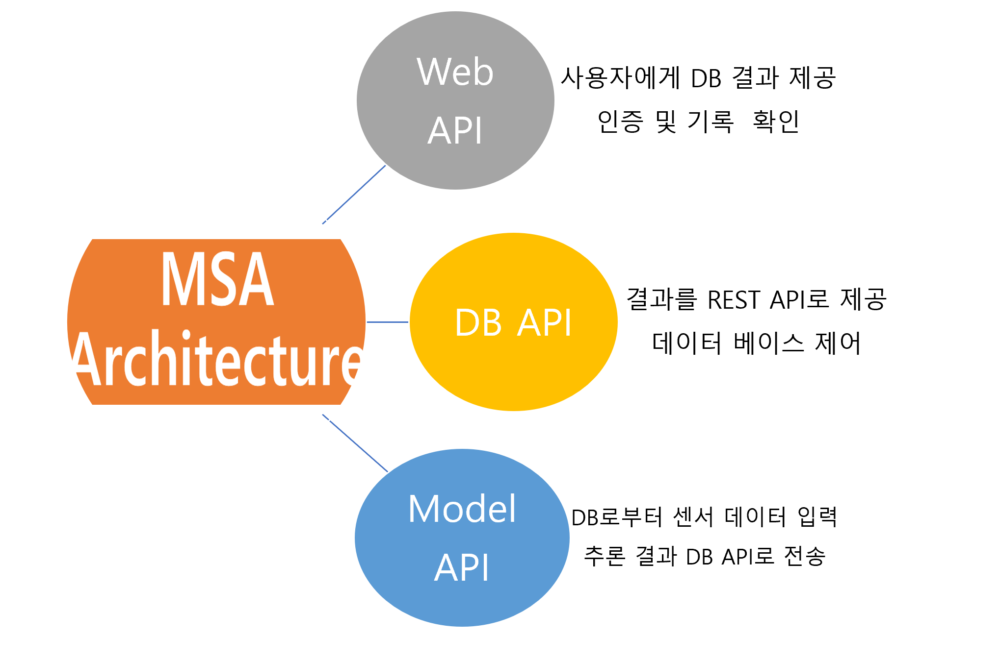
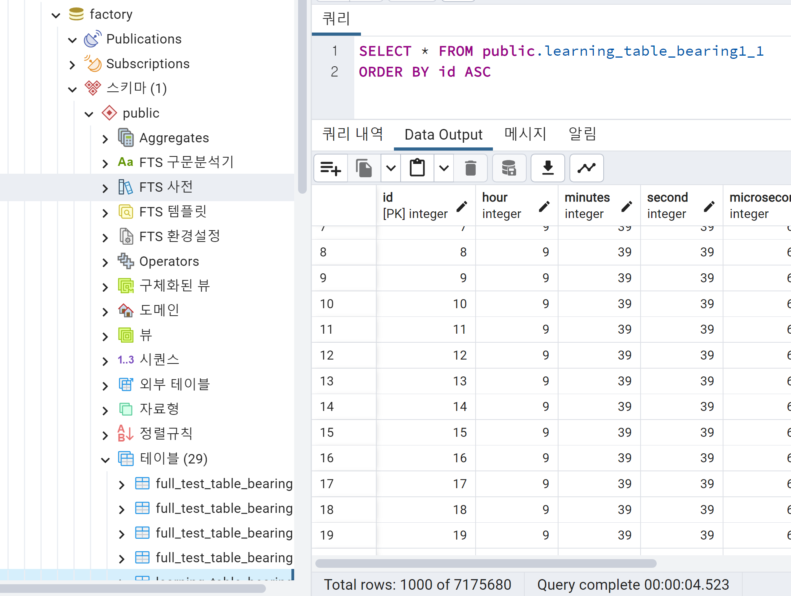
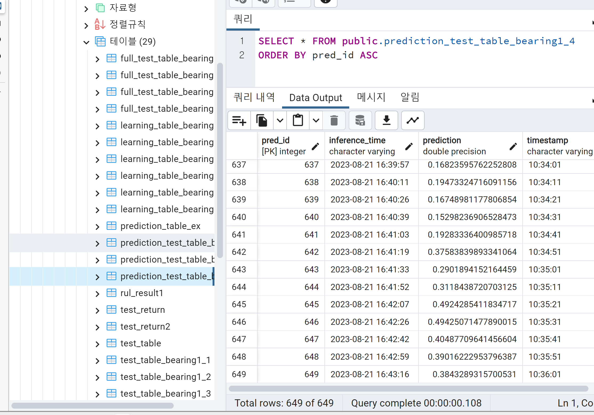
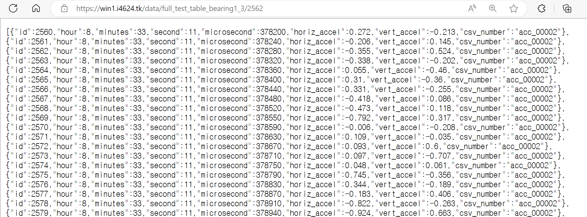
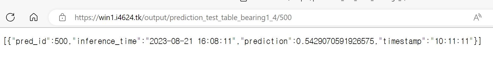
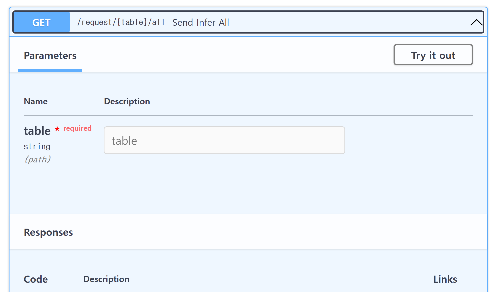
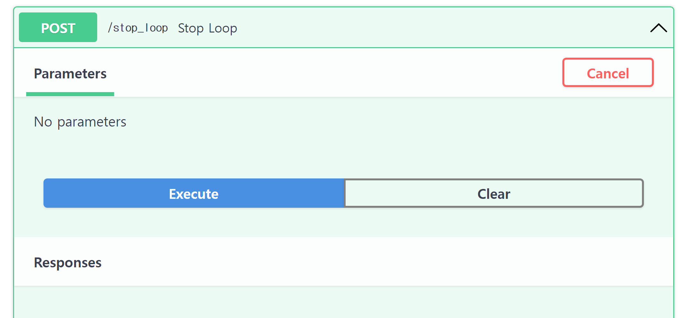

# DB server
- 디지털 대시보드 서비스 DB를 위한 repo
- 서비스 제공을 위해서는 서버 repo가 동작하고 있어야 합니다.
- DB server repo는 다른 서비스와의 연결을 위해 중간자 역할을 하는 DB API 서비스
  - 하단의 MSA 아키텍처 내용을 확인
- 프로젝트 디렉토리 구조
    ```
    DB_server
    ├── server
    │   ├── app
    │   │   ├── app_routing.py
    │   │   ├── db_row_count.py
    │   │   ├── dbinfo.py
    │   │   ├── insert_json_data_append.py
    │   │   ├── output_pred.py
    │   │   ├── outputdb.py
    │   │   └── request_infer.py
    │   ├── env
    │   │   ├── id.txt
    │   │   └── pw.txt
    │   └── main.py
    └── util
    ```

## 데이터베이스 서버 및 전체 시스템 작동구조
- 3개의 REST API Server 구조

- 3개의 작은 서비스간의 통신을 통해 하나의 시스템을 완성하여 제공하는 것이 시스템의 핵심  
- 본 레포는 3개의 서비스 중 DB API를 담당하는 레포

## DB server 실행 방법
1. env 파일 넣기
   - DB와 직접 통신 하는 경우를 대비한 id, pw
   - 프로젝트 디렉토리 구조 참고
2. server로 디렉토리로 이동 후 서버를 백그라운드에서 동작  
    - 백그라운드에서 동작하지 않는 경우 main.py를 직접 실행
    ```bash
    cd server
    nohup uvicorn --reload main:route --port {포트번호} --host 0.0.0.0 &
    ```
3. API 기능 테스트를 위해 fastapi 자체 docs 진입  
eg) localhost:{포트번호/portNumber}/docs

## DB 제어 기능
1. DB내 데이터 삽입
   - 학습 테이블 데이터 DB내 insert
   - util/learning_table.py 실행 결과
   

2. 추론서버에 추론 진행을 요청
   - 추론을 진행할 데이터 테이블
   
   - 추론서버에서 predict한 결과를 DB에 저장한 테이블
   

## API 기능(server/app/app_routing.py)
1. 센서 데이터 제공
   - get("/data/{table}/{id}")

2. bearing 고장 확률 추론 결과 출력
   - get("/output/{table}/{pred_id}")

3. bearing 고장 확률 추론 제어 (async 백그라운드 태스크로 진행) + 추론 중도 중단
   - get("/request/{table}/all")
     - 특정 bearing의 센서 데이터로 추론 진행

   - post("/stop_loop")
     - 진행중인 추론 중도 중단


## Acknowledgement
```
“본 연구는 과학기술정보통신부 및 정보통신기획평가원의 SW전문인재양성사업의 연구결과로 수행되었음“(2022-0-01127)
```
