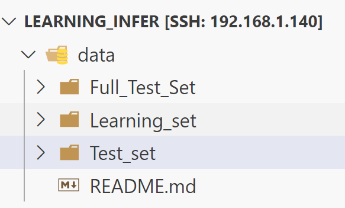
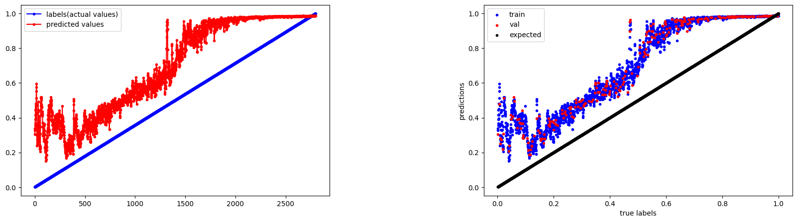
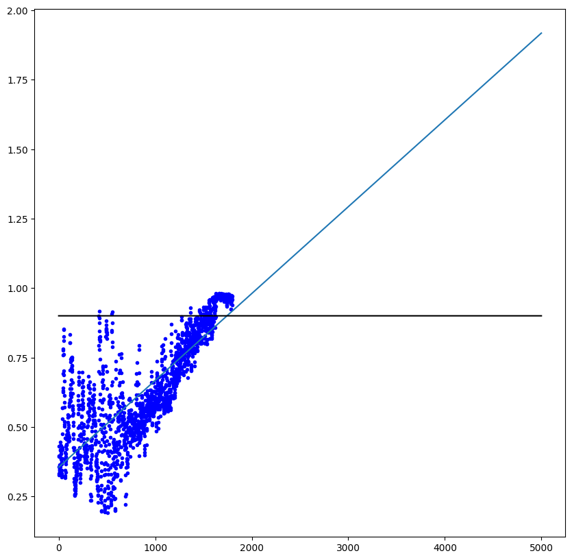

# learning_infer

RUL 예측을 위한 모델을 학습하고 이를 추론해서 데이터베이스 서비스에 제공하는 레포지토리 

this is training / inference server of RUL estimate repo
Repository give the 

 * 프로젝트 디렉토리 구조 
```
data
│   ├── Full_Test_Set
│   ├── Learning_set
│   └── Test_set
├── model
│   └── weight
│       └── {weight}.pth
│   └── {data processing code}
│   └── {learning and training code}
│   └── {utility code}
└── server
    ├── __pycache__
    ├── app
    │   ├── __pycache__
    │   ├── app_routing.py
    │   ├── cnn_lstm.py
    │   ├── data.py
    │   ├── db_connection.py
    │   ├── file_utils.py
    │   └── test_dataset_preparation.py
    ├── env
    ├── main.py
    ├── results
    │   ├── file
    │   └── plots
    └── static

```

## 추론 및 추론 서버를 위한 코드 

코랩 혹은 로컬 환경에서 돌릴 수 있도록 설정한 모델 관련 코드 
weight는 서버 쪽에서도 사용하는 가중치 코드를 
model은 로컬(코랩) 환경에서 모델 작성하고 러닝 셋을 학습하기 위한 코드들 
data는 PHM2012(FEMTO) 데이터를 사용 (별도 경로)
server는 이를 웹 서버로 실행하고 파일 in out 을 진행하기 위한 코드들 


https://i4624.tk/sharing/tbUNwOayc 

파일 다운로드는 이곳으로 

모든 환경은 우분투 20.04 에서 실행하고 있으며, 별도의 GPU는 요구하지 않습니다. 
GPU가 없으므로 CPU 환경에 따라 시스템 자원 상태의 영향을 받을 수 있습니다. 
가급적 메모리 32GB 이상의 VM 환경에서 실행하는 것을 추천하며, 전체 스토리지는 120GB 이상 설정하는 것을 추천합니다. 
코어는 많을수록 좋으며 테스트 환경은 proxmox-qemu host cpu: 20 thread 에서 진행했으므로 시스템 설치 및 테스팅 시 참고하시기 바랍니다. 

## 서버 코드 실행  

아래 requirements 를 설치하고, 본 코드를 아래의 명령어를 통해 실행합니다. 

경로는 프로젝트 루트 폴더 기준 

```bash
 cd /server 
 nohup uvicorn --reload main:route --port {포트번호/port Number} --host 0.0.0.0 &
```

실행 후 아래의 경로를 통해 접근한 다음 가중치 파일과 timestamp가 들어간 데이터를 입력하여 plot 및 json 결과 파일 확인 가능 
http://localhost:48000/docs
```
    ├── results
    │   ├── file
    │   └── plots
```

이 디렉토리 구조 참고 
가중치 파일 제작법과 timestamp 들어간 데이터 제작법은 모델 코드 실행 부분 참조 

데이터베이스와 연동된 부분은 DB_server 부분의 Readme 확인 


## 모델 코드 실행 

###  temp 파일 이동 
move.ipynb 을 사용해 각 베어링 별로 acc 데이터만 남기고, temp 데이터는 이동시켜 패키징 진행 

### 모델 패키징 
data_pkz.ipynb 에서 data 관련 경로에서 패키징을 진행한 다음 {테스트할 데이터 폴더명}+.pkz 형태로 패키징이 되는지 확인 
피클 import에서 오류가 나는 경우 관련 pip install 필요 

### 모델 학습 자료 준비 
CNN+LSTM_Dataset_Preparation.ipynb 에서 간편화 아래의 작업을 진행 
경로는 데이터 별로 작업한 다음 모든 데이터가 _all_ 이 붙게 나오면 성공 

### CNN+LSTM 모델 학습 
CNN+LSTM_Model_Train.ipynb 에서 준비된 자료를 이용해 학습을 진행 
학습 시 train 8 valid 2 정도로 분리하고, 이를 통해 적절한 RUL 값을 내보낼 수 있도록 설정 
학습 이후 나오는 가중치 파일을 weight 폴더에 저장하여 추론 시 사용 
정확한 학습 과정은 다음 문단 참고 

#### 학습 방법 
센서의 초기 상태를 RUL 0, 마지막 상태를 RUL 1이라 설정 
그 과정에서 각 timestamp 별 RUL 값을 센서 데이터를 '이미지'화 한 상태에서 비교, 이를 바탕으로 모델이 현재의 feature를 통해 RUL 값을 도출
즉 timestamp 별 RUL 값이 학습 데이터에 한해 직선으로 그려질수록 유효하게 학습된 것. 아래의 이미지와 비교 


### 테스트 데이터 준비 
Test_Data_pkz.ipynb 혹은 data_pkz.ipynb 을 이용하여 테스트 데이터에도 동일하게 패키징 

### 테스트용 데이터 작업 
Test_Dataset_Preparation.ipynb
테스트 데이터 작업에는 학습과 다르게 추론한 결과에 대한 timestamp 값을 별도로 이용해서 데이터베이스에 저장할 필요가 발생함 
그러므로 위의 노트북을 진행하면서 timestamp 값이 들어가도록 노트북을 순차 실행 

### 테스트 데이터 추론 
CNN+LSTM_Model_on_Test_Data_.ipynb 
가중치 파일 및 테스트 데이터를 입력하여 실행 
주의사항 
    * 추론 모델은 학습 모델과 동일하게 값이 지정되어야 함 배치가 32로 학습된 경우 추론도 32 
    * dropout 역시 동일하게 설정 
    * 모델 구조 역시 변경하면 안됨 
    * 그 외의 다른 값 역시 변경하지 않을 것 

추론해서 나온 결과 해석은 다음 문단 참고 

#### 추론 결과 해석 

테스트 데이터에 대한 추론 작업을 아래와 같은 이미지로 진행하게 되면 
RUL 1이 도달하는 경우를 완전 고장이라 해석하고 점들의 분포를 이용해서 직선 그래프를 그림. 직선 그래프를 그려서 1에 도달하는 시점이 베어링의 수명 도달 시점으로 해석 가능 
이를 통해 임계치를 설정하여 특정 값 이상(0.9)인 경우를 RUL 도달 이라는 것으로 설정하여 안내 



## requirements

```python
torch==2.0.1 
numpy==1.24.3 
pandas==2.0.3 
matplotlib==3.7.2 
fastapi==0.100.0 
```

## Acknowledgement
```
“본 연구는 과학기술정보통신부 및 정보통신기획평가원의 SW전문인재양성사업의 연구결과로 수행되었음“(2022-0-01127)
```